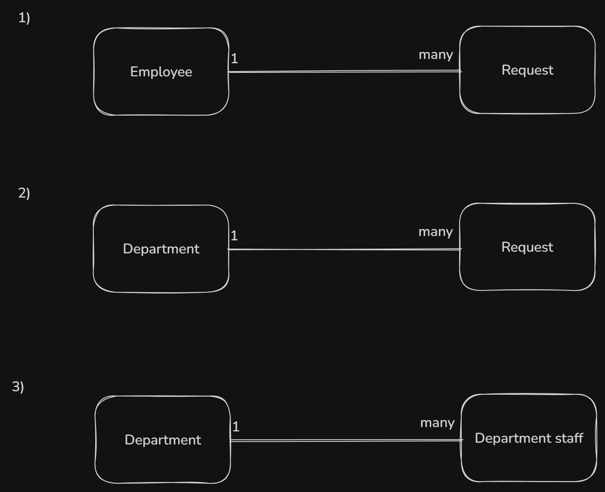
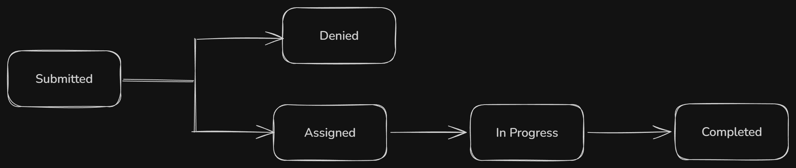

## Domain

### important entities
#### Employee
Represents a person using the service hub including the department staff/team who can use this hub to handle and send request.

example: An IT staff member can handle an IT request from another employee and can also submit a request to another department, such as HR, when they need something from that department.

So in short a department staff is an employee but not every employee is department staff.

#### Department
Represents the department of the company who receive the requests 

#### Department staff
Represents the organizational team (Department staff) responsible for handling requests.

- Employee + role = Department staff 
- (Employee + role)+ extra visibility = Department lead
- Department staff + extra visibility = Department lead

#### Request
Represents a request submitted through the service hub.

### relationships + cardinality

- 1- One Employee can submit many Requests.Each Request is submitted by one Employee.
- 2- One Department can handle many Requests.Each Request is handled by one Department.
- 3- One Department can have many Department Staff members.Each Department Staff member belongs to one Department.

Department staff ≠ Department 
Department staff are employees who belong to a department and are authorized to handle requests for that department.
### ownership
- Each request is created by one employee.
- Each request is assigned to one department for handling.
- Staff members handle requests as part of their department.

## Lifecycle + Rules 

### State transition

Assigned: The request has been routed to the department responsible for handling it. This does not mean that the request is assigned to a specific department staff member.
### Invariants 
- Every request must have a valid status.
- A request cannot have an invalid or undefined state.
- A completed request cannot move back to an earlier state.
- Only valid state transitions are allowed.

### Authorization + Sensitive Rules
- Users can only perform actions they are authorized to perform.
- Users must not be able to view requests or departmental information they are not authorized to access.

## Storage

### Relational/document reasoning 
A relational database is preferred because the system has clear relationships between employees, requests, and departments. These relationships are important when retrieving and managing request information, making joins an important part of the system.

Although a document database provides more flexibility in how data is structured, this flexibility is not a major requirement for the current system. The need for structured relationships and consistent data is more important than schema flexibility.

Therefore, relational storage is preferred over document storage.
### What is durable vs derived
#### durable data 
The system needs to permanently store:
- Employee information
- Department information
- Requests
- Request status
- Request creation and update information

This data must remain available after the request is submitted and after temporary system failures.
#### derrived data 
The system can calculate information from the stored data when needed, such as:
- Number of requests submitted by an employee
- Number of requests handled by a department
- Number of completed or pending requests

## Access 
### important querries/access patterns 
important queries :
- View an employee's requests 
- View pending requests for a department	
- View the current status of a request	
- View a specific request
- View request history

accesss patterns
- employee_id --> requests  
Used for the employee's "my requests" list.

- department_id + status --> requests
Used for a department's work queue (e.g. all Submitted IT requests). 

- status --> requests
Used for a system-wide / admin view (e.g. everything In Progress).

- request_id --> request
 Used when opening one request's detail page.

- request_id --> request history
Used to show a request's full timeline.

### Indexes only when justified 
-An index will be on department_id (IT, Finance, HR) can improve the retrieval of requests for a specific department especially as the number of requests grows. the database can use the index to go directly toward the relevant records instead of checking the entire table.
