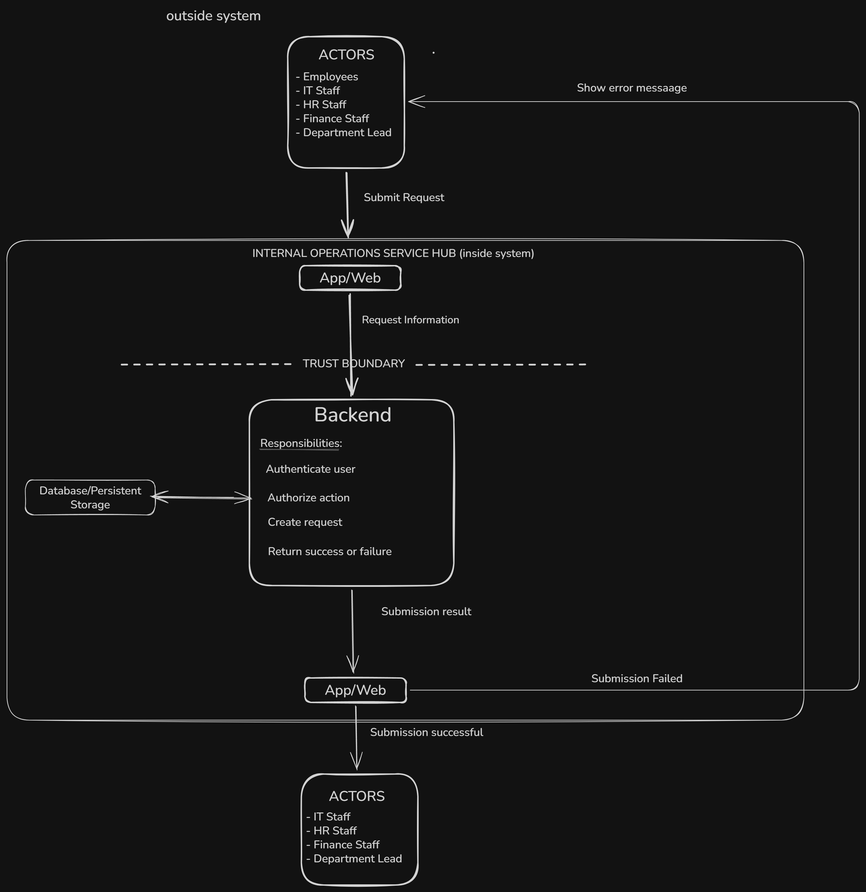

# Internal Operations Service Hub - Architecture

## Purpose + Scope
### Requirement driving the design
Employees can submit requests for help to the approriate department 

## Structure + Flow

### Components + Responsibilities

##### App / Web
- Collects request information from users.
- Sends requests to the Backend.
- Send success or failure results.

##### Backend
- Authenticates users.
- Authorizes actions based on user roles.
- Validates request information.
- Creates requests.
- Communicates with Persistent Storage.
- Returns success or failure.

##### Persistent Storage
- Stores employee and department information required by the system.
- Help with checking authentication and authorization
- Stores submitted requests.
- Keeps successfully saved requests available.

### Dependencies

Internal:
- App / Web depends on Backend.
- Backend depends on Persistent Storage.

External:
- None currently confirmed by the requirments

External dependencies such as Keycloak or an external Identity Provider could be added to manage authentication and user identity. However, they are not included in the current architecture because no requirement confirms the need for an external authentication system. The current design remains simple and handles authentication internally until additional requirements justify this integration.

## Trust + Resiliance
Information coming from the App / Web is not automatically trusted

### Failure Scenarios

- If Persistent Storage is unavailable, the Backend cannot save or retrieve requests and returns a failure response to the App / Web.
- If the Backend is unavailable, the App / Web cannot submit requests and informs the user that the operation failed.

### Scalability + Reliability
The expected number of users and daily requests is currently unknown.

Because of this, additional components such as Redis, message queues, or microservices are not currently justified.

The architecture can be reviewed later when the expected load is known.

## Decisions

### Communication Decision

The App / Web communicates directly with the Backend using request-response communication.

If freshness is not necessarily live using polling is better than live websockets

### Major decision 
We opted for a simple centralized architecture since the load is unkown and it satisfies the current requirment. 

With more details about the needed load we could add external dependecies with the help of the backend with a trust boundary.

The second actor box does not include employees because they cannot see all requests. Unlike regular employees, department staff are responsible only for managing requests related to their department.