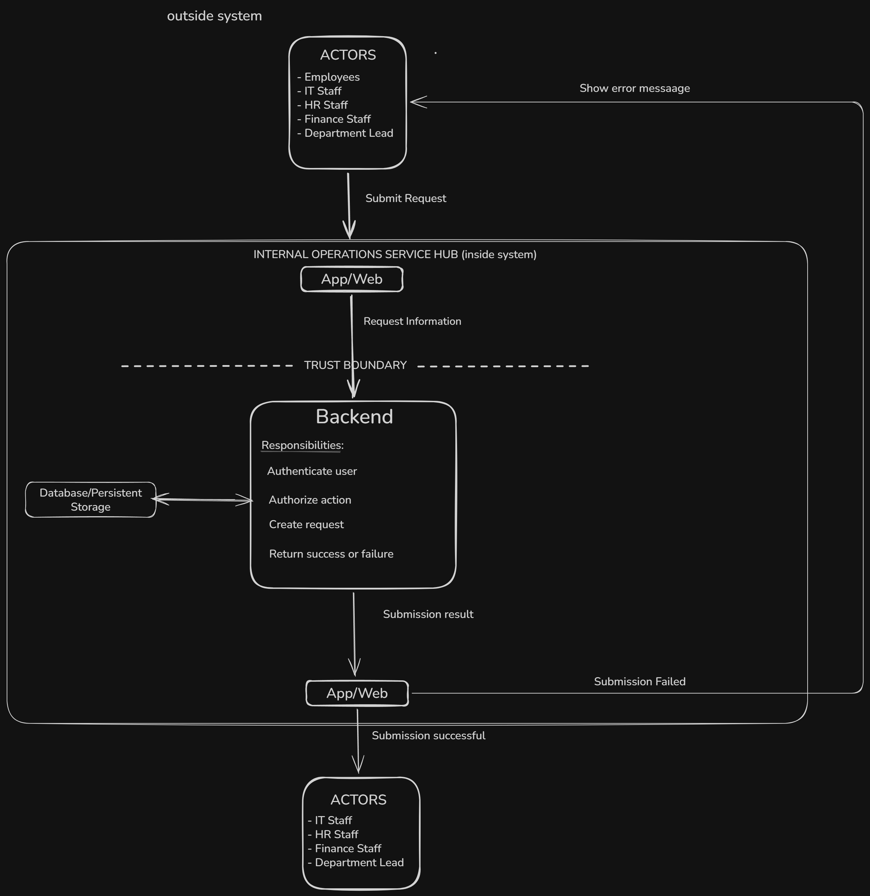
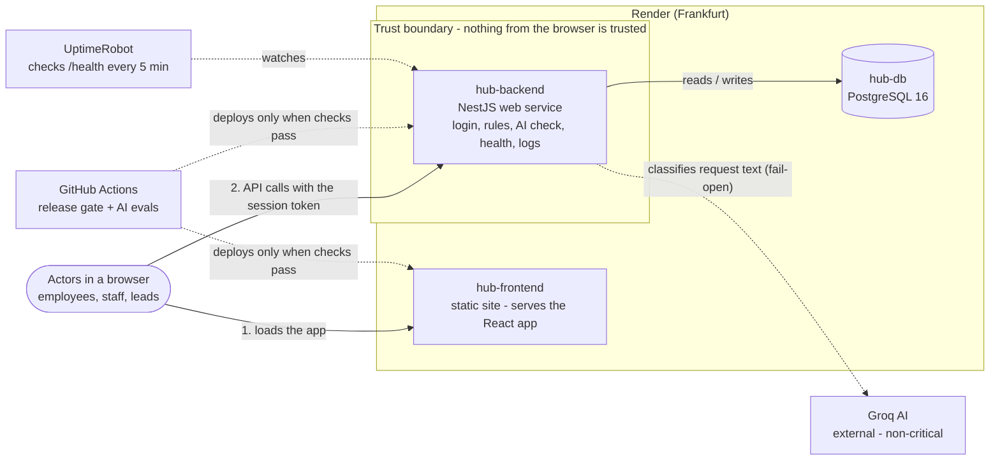

# Internal Operations Service Hub - Architecture

## Purpose + Scope
### Requirement driving the design
Employees can submit requests for help to the appropriate department 

## Structure + Flow

### Components + Responsibilities

##### App / Web
- Collects request information from users.
- Sends requests to the Backend.
- Send success or failure results.

##### Backend
- Authenticates users.
- Authorizes actions based on user roles.
- Validates request information.
- Creates requests.
- Communicates with Persistent Storage.
- Returns success or failure.
- *(Added later, see `docs/extra.md`)* Verifies username and password, issues a signed session token, and checks that token on every request.

##### Persistent Storage
- Stores employee and department information required by the system.
- Help with checking authentication and authorization
- Stores submitted requests.
- Keeps successfully saved requests available.
- *(Added later, see `docs/extra.md`)* Stores each user's credentials as a bcrypt-hashed password, never the plain password.

### Dependencies

Internal:
- App / Web depends on Backend.
- Backend depends on Persistent Storage.

External:
- Groq (AI request classification, v0.4 - see `docs/week4-production-ai.md`). A
  single outbound HTTP call from the Backend, not a new internal component -
  it does not change the centralized architecture, only adds one thing the
  Backend talks to besides Persistent Storage.

External dependencies such as Keycloak or an external Identity Provider could be added to manage authentication and user identity. However, they are not included in the current architecture because no requirement confirms the need for an external authentication system. The current design remains simple and handles authentication internally until additional requirements justify this integration.

## Trust + Resilience
Information coming from the App / Web is not automatically trusted.

### Failure Scenarios

- If Persistent Storage is unavailable, the Backend cannot save or retrieve requests and returns a failure response to the App / Web.
- If the Backend is unavailable, the App / Web cannot submit requests and informs the user that the operation failed.
- If Groq is unavailable, the Backend does not fail the request - it creates it anyway, unverified (see `docs/week4-production-ai.md`'s Fail-open section). Unlike the other two, this dependency is non-critical by design.

### Scalability + Reliability
The expected number of users and daily requests is currently unknown.

Because of this, additional components such as Redis, message queues, or microservices are not currently justified.

The architecture can be reviewed later when the expected load is known.

## Decisions

### Communication Decision

The App / Web communicates directly with the Backend using request-response communication.

If freshness does not need to be live, polling is better than live WebSockets.

### Major decision 
We opted for a simple centralized architecture since the load is unknown and it satisfies the current requirement. 

With more details about the needed load we could add external dependencies with the help of the backend with a trust boundary.

The second actor box does not include employees because they cannot see all requests. Unlike regular employees, department staff are responsible only for managing requests related to their department.

## As deployed (v1.0)

The structure above still holds - one App/Web, one Backend, one database (ADR-001).
This is where each part runs in v1.0 and what surrounds it (see ADR-004 and
`week5-release-operations.md`).

```mermaid
flowchart LR
  actors(["Actors in a browser<br/>employees, staff, leads"])

  subgraph render["Render (Frankfurt)"]
    fe["hub-frontend<br/>static site - serves the React app"]
    subgraph trust["Trust boundary - nothing from the browser is trusted"]
      be["hub-backend<br/>NestJS web service<br/>login, rules, AI check, health, logs"]
    end
    db[("hub-db<br/>PostgreSQL 16")]
  end

  groq["Groq AI<br/>external - non-critical"]
  gh["GitHub Actions<br/>release gate + AI evals"]
  up["UptimeRobot<br/>checks /health every 5 min"]

  actors -- "1. loads the app" --> fe
  actors -- "2. API calls with the session token" --> be
  be -- "reads / writes" --> db
  be -. "classifies request text (fail-open)" .-> groq
  gh -. "deploys only when checks pass" .-> be
  gh -. "deploys only when checks pass" .-> fe
  up -. "watches" .-> be
```
> **Note:** this diagram was drawn with Claude, but every part of it follows
> decisions I made and documented - each one is explained here:
>
> - **One Backend, one database, still centralized** - [ADR-001](decisions/ADR-001.md)
> - **Two Render services and PostgreSQL** - [ADR-004](decisions/ADR-004.md), and
>   [week5-release-operations.md](week5-release-operations.md) (section 1, remote target)
> - **Trust boundary and the session token** - the login and visibility rules in
>   [extra.md](extra.md)
> - **Groq is non-critical (fail-open)** - [week4-production-ai.md](week4-production-ai.md)
>   (fail-open section), proven live in [week5-failure-drills.md](week5-failure-drills.md) (drill 1)
> - **"Deploys only when checks pass"** - the release gate: the tests must pass before
>   Render deploys, while the AI evals only warn and never block -
>   [week5-release-operations.md](week5-release-operations.md) (section 3),
>   [`ci.yml`](../.github/workflows/ci.yml), [`evals.yml`](../.github/workflows/evals.yml)
> - **UptimeRobot watching `/health`** - [week5-release-operations.md](week5-release-operations.md)
>   (section 4, health, logs, monitoring and alerting)

The frontend only hands out files; every real interaction goes from the browser
straight to the backend, which checks the session token, applies the rules and is
the only part that talks to the database or to Groq.

### Dependencies and what each one can break

| Dependency | Kind | If it goes down |
|---|---|---|
| PostgreSQL (Render) | runtime, **critical** | nothing can be read or saved - `/health` reports `error` (503) |
| Groq | runtime, **non-critical** | the hub keeps working; requests are saved *Not checked* (fail-open) - `/health` reports `degraded` |
| Render | hosting platform | the whole hub is unavailable - the usual trade-off of a hosting provider |
| GitHub Actions | build and release tool | nothing changes for users; new releases cannot pass the gate until it is back |
| UptimeRobot | monitoring tool | nothing changes for users; outages are no longer emailed until it is back |